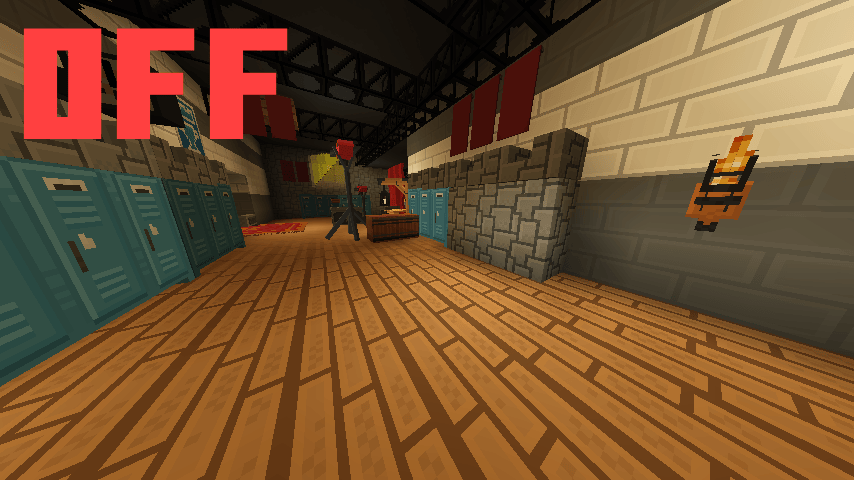

# ForceRender

A minimal **client-side** Fabric mod for **Minecraft 1.21.x** that keeps custom display models
looking right:

- **Force render** — prevents armor stands and item frames from being frustum-culled when they are
  within a configurable range, so large custom models stop popping out of view at the screen edge.
- **Fix item translucency** — stops translucent items (held, worn, or framed) from disappearing or
  being clipped when they sit behind water and glass.

No commands, no tags — just open Mod Menu, flip the toggles, and your furniture stays visible.



---

## The Problem

Vanilla Minecraft skips rendering entities whose **bounding box** is outside the camera frustum.
Armor stands and item frames have a very small physical box, but custom resource packs (such as
those used by [ItemsAdder](https://github.com/LoneDev6/ItemsAdder-Wiki) furniture) attach display
models that are **much larger** than that box.

Result: the custom furniture **disappears** the moment the armor stand's tiny box slides off the
edge of the screen, even though most of the model is still clearly visible.

## The Fix

ForceRender mixes into `EntityRenderer#shouldRender`.  For every armor stand and item frame within
the configured range, it returns `true` immediately — bypassing the frustum check.  Entities
outside that range fall back to vanilla behaviour, so performance is only affected near the player.

## Translucent Items Behind Water / Glass

Minecraft renders translucent **entities** (armor stands and the items they hold or wear) in a
separate pass from translucent **blocks** (water, glass).  Render layers are only depth-sorted
*within* each pass, never across them, so a translucent item and a translucent block have no defined
blend order relative to each other.  The result: transparent items **vanish or get clipped** the
moment they sit behind or near water or glass.

ForceRender fixes this by intercepting the two render layers Minecraft uses to draw items in the
world — `TexturedRenderLayers#getItemTranslucentCull` (the block-atlas layer used by most items) and
`RenderLayers#itemEntityTranslucentCull` (the per-texture layer) — and returning the matching
**cutout** layer instead.  Cutout is alpha-tested and writes depth like an opaque surface, so items
resolve against translucent blocks correctly.  The only trade-off is the usual one for cutout: no
soft alpha fade (each pixel is either fully drawn or discarded), which is imperceptible for the vast
majority of item textures.  Toggle it off if you specifically need soft transparency.

## Settings (Mod Menu)

Open **Mod Menu → ForceRender → (gear icon)** to access the config screen:

| Setting | Description | Default |
|---|---|---|
| **Force Render** | Enable or disable the frustum-culling bypass | Enabled |
| **Render Range** | Entities beyond this many blocks use vanilla culling | 32 blocks |
| **Fix Item Translucency** | Draw world items as cutout so they don't vanish behind water/glass | Enabled |

Settings are saved to `.minecraft/config/forcerender.properties` and can also be edited by hand.

> **No Mod Menu?**  The mod still works; just edit `forcerender.properties` directly.

## Installation

1. Install [Fabric Loader](https://fabricmc.net/use/) and [Fabric API](https://modrinth.com/mod/fabric-api) for **Minecraft 1.21.1**.
2. *(Recommended)* Install [Mod Menu](https://modrinth.com/mod/modmenu) for the in-game settings screen.
3. Drop `forcerender-<version>.jar` into your `mods/` folder.

> **Server note:** This is a **client-side only** mod.  It is never loaded server-side and does
> not need to be installed on the server.

## Building from Source

Requirements: JDK 21

```bash
# One-time: generate the Gradle wrapper binary
gradle wrapper --gradle-version=9.4.0

# Build
./gradlew build
```

Output: `build/libs/forcerender-<version>.jar`

## How It Works — Technical Details

```
EntityRenderer#shouldRender(T entity, Frustum frustum, double cameraX, double cameraY, double cameraZ)
```

**Vanilla logic:**
1. Get the entity's `getVisibilityBoundingBox()` — very small for armor stands.
2. `frustum.isVisible(box)` → `false` → entity skipped.

**With ForceRender:**
1. If mod is disabled → vanilla logic unchanged.
2. If entity is not an `ArmorStandEntity` or `ItemFrameEntity` → vanilla logic unchanged.
3. If distance to camera > configured range → vanilla logic unchanged.
4. Otherwise → return `true` immediately, bypassing the frustum check.

The Mixin is declared in the `"client"` array of `forcerender.mixins.json`, so it never runs
on a dedicated server.

## Compatibility

| Minecraft   | Fabric Loader | Fabric API | Mod Menu      |
|-------------|---------------|------------|---------------|
| 1.21.1 – 1.21.11 | ≥ 0.16.0 | `*`        | ≥ 11.0 (opt.) |

> Built against 1.21.11; the JAR also loads on 1.21.1 – 1.21.10.

## License

[MIT](LICENSE)
